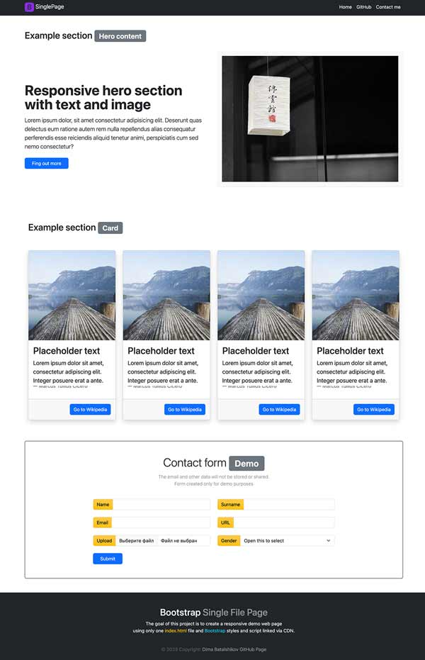

### <h1>One file page project</h1>

### Descriptiom:

This is demo project. <a href="https://damiandream.github.io/Bootstrap-Single-File-Page/" target="_blank">Web-page link</a>

This page was created only with an HTML5 file, It was not used extra CSS styles except Bootstrap Library.

Bootstrap is injected into this page via the CDN link.

    

